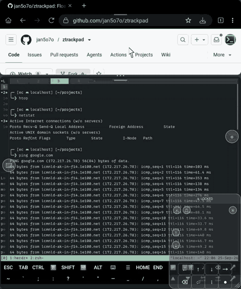
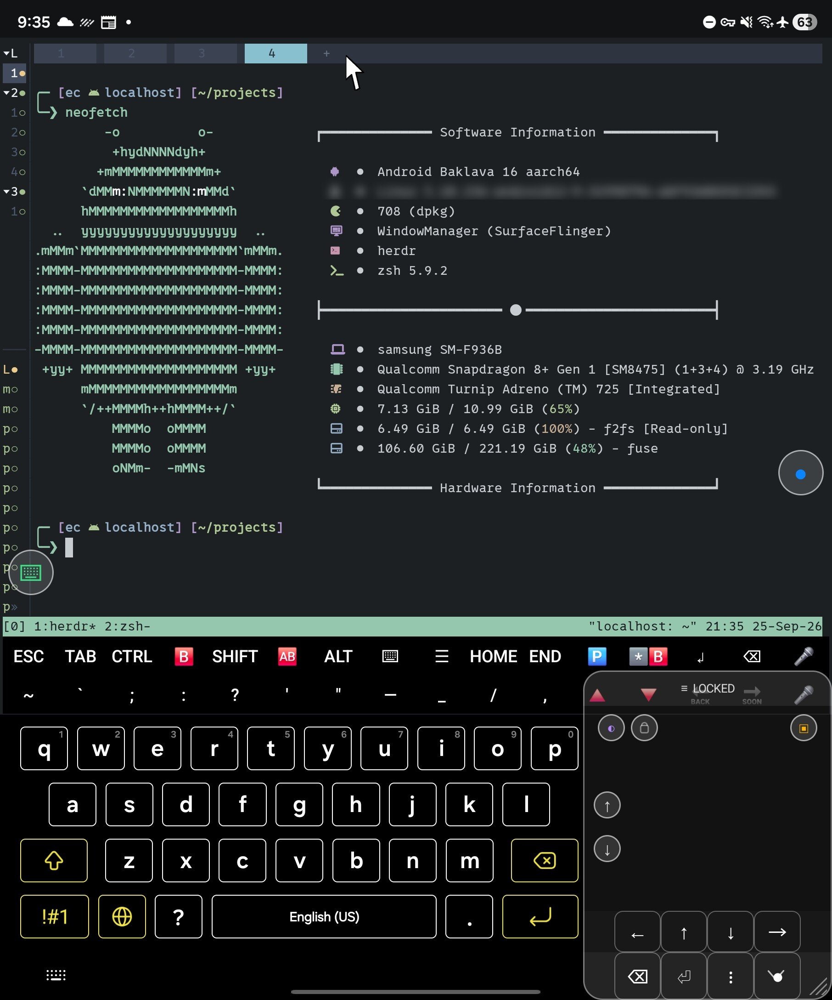
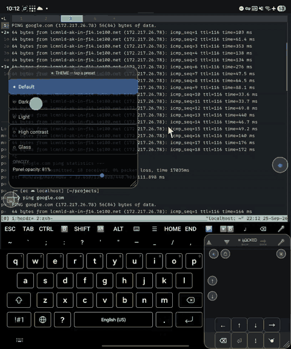
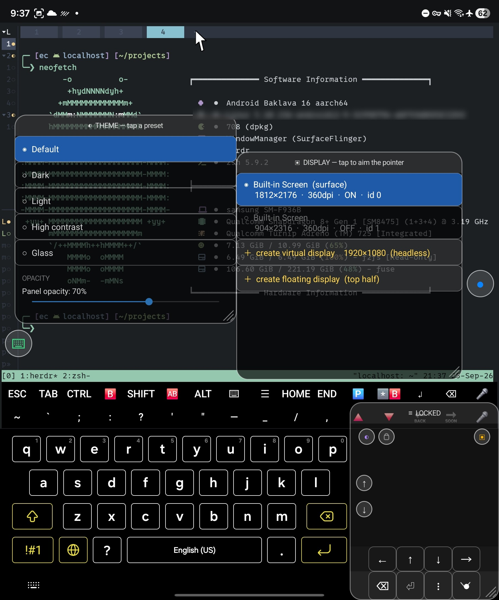

# Z Trackpad

A floating **trackpad + pointer**, a **programmable keys panel**, and a **display
picker / virtual display** for Android — built entirely on the phone with a hand-rolled
Termux toolchain: no SDK install and no Gradle. The build downloads only the platform
jar it compiles against.



Designed for foldables: an unfolded Fold is a small desktop with no pointer.

## The problem it was built for

Built for one workflow: **an agent harness in Termux, with a browser beside it to check what
the agent wrote.** It needs three things a phone does not give you.

- **A pointer.** A touchscreen has no hover and no precise drag, so a browser's devtools, its
  tab strip or its `✕` are guesses. The pad draws an arrow and injects it as a real
  `SOURCE_MOUSE`, which is why a window drag behaves like a laptop's. The tabs you want are up
  in Termux's tab strip, away from the keys.
- **The keys.** `Esc`, `Ctrl+C`, `Tab`, `Ctrl+B`, the arrows, `PageUp`/`PageDown`: the soft
  keyboard has none of them. The panel's rows follow Termux's extra-keys rows, and the layout is
  a string you can replace at runtime.
- **Room for both.** The browser and the terminal share one screen, and the split divider is
  thin enough that a finger misses it.

The display picker covers the rest: the pointer can be aimed at the cover screen, an HDMI or
XREAL output, or a virtual display the app creates.

It was built and driven on a **Galaxy Z Fold 4** (SM-F936B, Android 16, aarch64), in
Termux, with no desktop in the loop — and that is the point: a phone with a package
manager is a complete build host for this app. Nothing in the build reads a device model,
so any machine with the tools in [Prerequisites](#prerequisites) should do the same.

## The controls

Two floating dots, and four controls docked inside the pad:
- **`●` (right, default)** — toggles the trackpad
- **`⌨` (left, default)** — toggles the keys panel
- Both dots are draggable and, on release, **snap to the nearer vertical edge** — they
  cannot be parked half off the screen, and a short flick no longer counts as a tap.
- **`◐`, the lock, and `▣`** — the theme menu, the move/resize lock, and the display
  picker. All three live in the pad, just under its title bar: `◐` and the lock on the
  left, `▣` on the right. They used to float too, but docked they cannot be lost behind
  another window — and they stay put when you drag the pad around.
- **`↑` `↓`** — round buttons on the pad's left edge that nudge the split-screen divider,
  one 8% step per press. `↑` grows the bottom pane, `↓` shrinks it.

## A foldable, unfolded

The shape of the device is why the controls above exist:

- **Click-through keeps the big screen usable.** The pad can cover the corner of an app and
  still click the thing underneath it, which is the difference between a trackpad and an
  obstruction. Measured in split screen, not just designed that way.
- **The two screens pair up.** The display picker aims the pointer at the cover screen while
  the pad and the keys panel stay on the inner one. Retargeting and per-display injection are
  verified; what is missing is the *panels*-on-the-other-screen case — display 1 reports
  `canHostTasks=false`, so the controls stay where your fingers are.
- **DeX and glasses are what it was aimed at.** The same pointer is meant to drive an
  external desktop through DeX — it is the reason `SOURCE_MOUSE` injection is used at all
  instead of accessibility gestures. [AGENTS.md](AGENTS.md) keeps the honest split between
  what is confirmed by hand on that setup and what is only mechanically verified, and this
  README follows the same rule.



That is the whole app on the inner display: the keys panel across the bottom (a custom
layout, `ESC` through `⌫ back`), the pad down the right edge with its `≡ LOCKED` handle, its
`◐` / lock / `▣` dots and the `↑`/`↓` split nudges, and the two floating dots on the left
and right edges. The drawn pointer is up in Termux's tab strip.

That arrow is the pointer, injected as a real `SOURCE_MOUSE` — which is why hover, click and
scroll behave like a desktop's rather than a touchscreen's. **[What it does](#what-it-does)**
below walks the features with a clip for each one that has footage.

The recordings are in `docs/media/`: [driving a browser](docs/media/demo-browser.mp4) (75s),
[Termux with the keys panel](docs/media/demo-termux.mp4) (57s) and [creating a display](docs/media/demo-vdisplay.mp4)
(75s) — each one cut where the screen showed something personal, noted in
[docs/screenshots](docs/screenshots/README.md). Those are plain links, and
GitHub serves a committed `.mp4` as a download rather than playing it, so they fetch the file.

## Installing it

**It is not on any app store, and it cannot be.** The accessibility service injects taps, drags
and key events — that is the whole point of the app — and Play's policy does not allow an
accessibility service used for input injection. So it is a **sideload**: either take the built
APK from the [latest release](https://github.com/jan5o7o/ztrackpad/releases/latest), or build it
yourself with the [quick start](#quick-start-termux-on-the-phone) below. Either way you end up
with the same app.

**From the release APK** — download it, then let your browser or file manager install it. Android
will ask you to allow installing unknown apps for whichever app is doing the installing; that is
the normal sideload prompt, and it is per-app. Via a computer instead:

```bash
adb install -r ztrackpad.apk
```

The release APK is signed with the maintainer's key. A copy you build yourself is signed with
*yours*, so Android treats them as different apps: **uninstall one before installing the other.**
Both are the same code, so there is no reason to want both.

**Requirements either way** — Android 13 or newer, and [Shizuku](https://shizuku.rikka.app/)
running with this app granted permission. Shizuku is what gives the app the privileges to inject
real input; without it the pads appear but keys and drags do nothing. Shizuku itself needs adb
(or root) to start after a reboot, which is the one real setup cost of using this app at all.

**After installing**, enable the accessibility service: open the app and tap *Open Accessibility
Settings*, then turn on **Z Trackpad** under *Installed services*. Two small dots appear, and
that is it.

## Quick start (Termux, on the phone)

The build-from-source path — skip it if you installed the release APK above.

Everything runs in Termux on the device itself — reference environment: **Galaxy Z Fold 4**
(SM-F936B), Android 16 / One UI, aarch64. An agent can follow this literally; each step is
checked in [Prerequisites](#prerequisites).

```bash
# 1. the repo and the toolchain — these are separate Termux packages, not one SDK
pkg install git aapt2 aidl d8 apksigner openjdk-21 zip python android-tools
git clone https://github.com/jan5o7o/ztrackpad.git ~/ztrackpad

# 2. the platform jar the build compiles against (27 MB, deliberately not committed)
mkdir -p ~/ztrackpad/sdk/platforms/android-36
curl -Lo /tmp/platform-36_r02.zip \
  https://dl.google.com/android/repository/platform-36_r02.zip
unzip -o /tmp/platform-36_r02.zip 'android-36/android.jar' \
  -d ~/ztrackpad/sdk/platforms/
#   -> ~/ztrackpad/sdk/platforms/android-36/android.jar

# 3. build + install (needs an adb connection — see Prerequisites)
cd ~/ztrackpad
KSPASS=... ./build.sh
adb install -r out/ztrackpad.apk

# 4. enable the accessibility service (append, do not clobber other services)
SVC=app.so7o.ztrackpad/app.so7o.ztrackpad.TrackpadService
CUR=$(adb shell settings get secure enabled_accessibility_services | tr -d '\r')
case "$CUR" in
  *"$SVC"*) : ;;
  null|"")  adb shell settings put secure enabled_accessibility_services "$SVC" ;;
  *)        adb shell settings put secure enabled_accessibility_services "$CUR:$SVC" ;;
esac
adb shell settings put secure accessibility_enabled 1

# 5. verify - works any time. Do NOT check logcat here: the app only logs at service
#    startup, so a freshly cleared log is empty even when everything is fine.
adb shell am broadcast -n app.so7o.ztrackpad/.VDisplayReceiver \
    -a app.so7o.ztrackpad.VDISPLAY --es op status
#   Broadcast completed: result=0, data="shizuku=ready id=-1 kind=none window=hidden ..."
#     ^ shizuku=ready is the bit that matters. shizuku=no means step 4 is unfinished.
```

At startup the app also logs `connected surface=... target=display ...`, so
`adb logcat -s ZTrackpad:*` is useful while troubleshooting — just clear the log and
restart the service (`settings put secure accessibility_enabled 0` then `1`) before
expecting that line.

Then tap the `●` bubble that appears. If Shizuku is not running, the app still
starts but the keys panel and drag do nothing — see step 4 of Prerequisites.

### What an agent can and cannot do here

Most of this is agent-doable. Four steps are not, and an agent should stop rather than
improvise around them.

| Step | Agent? | Notes |
|---|---|---|
| Install packages, fetch the jar, build, sign, install | **yes** | plain shell, all above |
| Enable the accessibility service | **yes** | step 4; append, never clobber |
| Verify state | **yes** | prefer the broadcast `status`; logcat only logs at startup |
| Create/show/hide/destroy a virtual display | **yes** | `skills/ztrackpad-vdisplay/` (or the raw broadcast) |
| **Enable wireless debugging** | **no** | Developer-options toggle. Must already be on. |
| **Start Shizuku** | **no** | needs the Shizuku app, or a human-initiated start. Not persistent without root, so it must be redone after every reboot. |
| Grant the Shizuku permission | **no** | a runtime dialog; `pm grant` does not cover this one |
| Drive the UI by tapping | yes, but **fragile** | `adb shell input tap X Y`. The panels move and resize, and the picker grows a row per display, so a tap one row off hits the wrong control — prefer the broadcast API |

## Prerequisites

Five things, each with a check. Nothing here is optional except where stated.

### 1. Termux packages

```bash
pkg install git aapt2 aidl d8 apksigner openjdk-21 zip python android-tools
```

| tool | Termux package | why |
|---|---|---|
| `aapt2` | `aapt2` | compiles and links resources |
| `aidl` | `aidl` | generates the `IShellService` binder interface |
| `javac`, `keytool` | `openjdk-21` (17 also works) | compiles Java; makes the keystore |
| `d8` | `d8` | dexes the classes |
| `apksigner` | `apksigner` | signs the APK |
| `zip`, `python3` | `zip`, `python` | repackage the APK; check zip alignment |
| `adb` | `android-tools` | install, and drive the scripts |
| `git` | `git` | to get the repo in the first place |

The package names above are Termux's. **Nothing here is Termux-specific**: on a desktop the
same binaries come from Android's build-tools (`aapt2`, `aidl`, `d8`, `apksigner`) plus any
JDK, `zip` and `python3`. After that, `pkg install` is the only Termux-flavoured line left
in the build.

`zipalign` is **not** needed — `build.sh` checks STORED-entry alignment itself with
python3.

```bash
for c in aapt2 aidl d8 apksigner javac keytool zip python3 adb; do
  command -v $c >/dev/null || echo "MISSING: $c"
done
```

### 2. The Android platform jar

Not committed (27 MB). Fetch it once:

```bash
curl -Lo /tmp/platform-36_r02.zip https://dl.google.com/android/repository/platform-36_r02.zip
unzip -o /tmp/platform-36_r02.zip 'android-36/android.jar' -d ~/ztrackpad/sdk/platforms/
```

Check: `ls -l ~/ztrackpad/sdk/platforms/android-36/android.jar` → about `27768026` bytes.
The `libs/*.jar` files *are* committed, so nothing else needs downloading.

### 3. An adb connection to the device

Needed for `adb install` and for everything in [Scripting it](#scripting-it).
Wireless debugging must be on (Developer options → Wireless debugging), then:

```bash
adb connect <phone-ip>:<port>      # port changes on every toggle
adb devices                        # must list the device as "device", not "offline"
```

The port is not stable, so re-read it from the Wireless debugging screen each time. An mDNS
scan for the `_adb-tls-connect._tcp` service finds it without looking — but stale
advertisements linger after the toggle goes off, so try every port it reports and not just
the first.

### 4. Shizuku, running and permitted

- Install the **Shizuku** app (`moe.shizuku.privileged.api`).
- **Start it.** Without root, Shizuku does not survive a reboot — it has to be started
  again through wireless debugging after every restart.
- Grant ztrackpad its permission when it asks (the app requests it on first run).

Check: `adb shell ps -A | grep shizuku_server` shows a line. If it is absent, the app
runs in a degraded state rather than failing: arrow keys still work, but **every
keycode is dropped, and drag and DeX input do nothing** — the app logs
`key ignored - Shizuku not ready`.

### 5. Android version

| | value | consequence |
|---|---|---|
| `minSdk` | 30 (Android 11) | the app installs |
| `GLOBAL_ACTION_DPAD_*` | added in API **33** (Android 13) | the arrow keys genuinely need **Android 13+** |
| `targetSdk` | 36 | compiled against Android 16 |

So the honest floor is **Android 13**, not the "Android 14+" an earlier version of this
file claimed.

## What it does

Seven things, with a clip where one exists. Anything marked *no clip yet* is implemented and
verified — it simply has not been recorded, which is worth saying rather than padding the list
with a picture of something else.

### A pointer you can actually see

The hero clip at the top of this file shows it. A finger on the pad moves a drawn arrow over
any app, injected as a real `SOURCE_MOUSE` — so
hover, click, scroll and window drag all behave like a desktop's. Tap to click, hold still to
long-press, two fingers to scroll. The arrow in that clip is the app's, not the system's.

### A keys panel for the keys Android does not have

`ESC`, `TAB`, `CTRL`/`ALT`/`SHIFT` combinations, `PageUp`/`PageDown`, arrows, `⏎`, `⌫` and
tmux-style macros such as `CTRL+B` twice — with sticky modifiers, hold-to-repeat, and a layout
that can be replaced at runtime with a single string. *No clip yet*; every row is listed under
[Trackpad layout](#trackpad-layout).

### Themes and opacity



Five presets — Default, Dark, Light, High contrast and Glass — plus an opacity slider that
scales the panel fills without touching text or borders. More in [Themes](#themes).

### Any display, including one that is not there


Aim the pointer at the cover screen, an HDMI or XREAL output, or a **virtual display the app
creates itself** — floating in the top half of the phone, or headless off-screen. More in
[Display picker](#display-picker--drive-another-screen).

### Split nudges, edge scrolling, and a lock

`↑`/`↓` on the pad's left edge move a stacked split's divider by 8% of the screen height; the
pad's own left and right edges scroll like a laptop's strip; and the lock dot freezes the pad's
geometry while leaving input alone. *No clip yet* — see [Split screen](#split-screen) and
[Trackpad layout](#trackpad-layout).

### Click-through, so the pad is not an obstruction

A click aimed under a panel still reaches the app beneath it, measured in split screen rather
than merely designed. *No clip yet* — see [Features](#features).

### Scriptable, if you would rather not tap

`am broadcast` drives the virtual display, the keys layout and the pad lock, so the app can be
part of a script. *No clip yet* — see [Scripting it](#scripting-it).

## Features

- Floating trackpad + drawn pointer (no root; overlay windows)
- Real `SOURCE_MOUSE` injection via Shizuku for hover/click/drag — this is what
  lets a window actually be moved, which `dispatchGesture` cannot do reliably
- Shizuku is used when ready, with accessibility `dispatchGesture` fallback
- Keys panel mirrors the owner's Termux extra-keys rows:
  - Row 1: `ESC TAB CTRL 🅱️ SHIFT 🆎️ ALT HOME END 🅿️ *️⃣🅱️ ⏎ ⌫`
  - Symbol row: `~ \` ; : ? ' " - _ / ,`
  - Number + QWERTY rows, `SHIFT z x c v b n m ⏎`, nav row, `space` + `⌫ back`
  - tmux macros fire (e.g. `*️⃣🅱️` = `CTRL+B` twice)
- **The whole key layout is customizable at runtime** — one spec string, no rebuild:
  `vdisplay keys '<spec>'`. Format and examples in `skills/ztrackpad-vdisplay/SKILL.md`.
- Sticky `CTRL/ALT/SHIFT` modifiers, **hold-to-auto-repeat** on all keys
- **Haptics** on key taps (system CLICK effect, honours `haptic_feedback_enabled`)
- Press feedback (keys highlight blue while held)
- All panels are **draggable** (top handle) and **resizable from any of the four
  corners**; geometry persists across restarts. Only the **bottom-right grip is drawn** —
  as the usual diagonal strokes — and the other three corners are invisible touch
  targets, because a grip is nothing but a hit area and four handles on screen is just
  clutter. (The pad's top-left corner briefly had no grip while the `◐` menu button lived
  in the title bar; the button sits below the handle now, so all four work.)
- Click-through: injected clicks briefly drop `FLAG_NOT_TOUCHABLE` on the panels
  so desktop icons *under* the trackpad are still clickable. The flag needs a moment to be
  applied — `updateViewLayout` only queues it — so the injection waits ~40ms and the flag
  stays up for the gesture's whole length. Measured in split screen, where the pad covers
  most of a pane: a tap with the pointer *under* the pad lands on the app underneath.
- **A pad lock** (the drawn dot beside `◐`): tapped, the pad refuses to move or resize — the
  handle reads `≡ LOCKED` — and it stays locked across restarts. The grips and the drag
  listener stay attached and decline, so an accidental tap cannot be mistaken for a broken
  control. Edge scrolling still works while locked: the lock is about geometry, not input.
- **Edge scrolling**: a touch that starts within `dp(28)` of the pad's left or right edge
  scrolls instead of moving the pointer — a laptop-style strip for one finger. It runs at
  half the two-finger rate in 12px-of-travel steps (see [Trackpad layout](#trackpad-layout)).
- **Split-screen divider buttons**: `↑`/`↓` on the pad's left edge nudge the divider between
  a top and bottom pane, via a real injected drag on the divider itself. See
  [Split screen](#split-screen).
- **Display picker** — aim the pointer at any display (cover screen, HDMI/XREAL,
  virtual/overlay) while the panels stay on the phone

## Trackpad layout

```
        ≡ MOVE              ← drag handle (tap to re-centre; reads ≡ LOCKED when locked)
 ◐ 🔒   ┌─ surface ─────┐   one finger moves · tap = click · hold then move = drag
 ↑ ↓    │              │   the outer dp(28) of each side scrolls instead of moving
        └ ←  ↑  ↓  → ───┘   arrows (hold to repeat)
          ⌫   ⏎   ⋮   ◉      backspace · enter · right-click · pointer toggle
```

Gestures: one-finger drag moves the pointer · tap clicks · hold-still-then-move drags ·
two-finger tap = right-click · two-finger drag = scroll · **swipe up/down along either
edge = scroll**, which is the same scroll at half the rate in smaller steps, so a side
swipe is a fine adjustment where the two-finger drag is a coarse one. The `↑`/`↓`
buttons take over their slice of the left strip.

Scroll arithmetic, so the feel is predictable: a flush is injected every 12px of finger
travel on the strip (36px for the two-finger drag), each flush sends `travel × 0.7`
scroll units, and a flush is capped at those 12px with the remainder carried — so a fast
flick moves in the same small steps rather than one jump. In a list like Settings that is
roughly 23px of content per step; the conversion from scroll units to pixels belongs to
the app being scrolled, so a browser may move a different distance.

## Display picker — drive another screen



Tap `▣` (in the pad, under its title bar) to list every display and tap one to aim the
pointer at it. Two displays
are involved and they are **independent**:

| | meaning | default |
|---|---|---|
| **surface** | where the panels are drawn — the display your fingers can reach | the default display |
| **target** | where the pointer and every injected event go | same as surface |

For an XREAL/DeX screen these *must* differ: you drag on the phone and the cursor
moves on the glasses. The pad chip reports the target (`≡ MOVE · SZ · ▶ 1920×1080`).

- Finger deltas are scaled by `outW/screenW`, so "drag across the pad" means the
  same fraction of the screen on any display. Ratio is 1 when they match, so the
  normal case is byte-for-byte the old behaviour.
- Every pointer is **drawn by us**; the system pointer is always hidden. A window we
  own cannot be composited into another display's output, and the system pointer is
  not rendered on external/virtual displays at all, so on a target display the arrow
  is a **second overlay window opened on that display** (`createDisplayContext`). On
  the phone screen it is an overlay there; over the floating window it is drawn on
  top of that window. Before this, pointing at the XREAL showed no cursor whatsoever.
- The target is persisted by **name + physical mode size**, never by display id —
  ids get reused as displays come and go (`Overlay #1` is id 7 on this device).

### Shizuku is mandatory for a split

`dispatchGesture()` has no display parameter, so the accessibility fallback can
only ever stroke the surface display. When target ≠ surface and Shizuku is not
ready, `sendStroke()` **refuses** rather than silently clicking the wrong screen,
and the pad chip shows `⚠ NO SZ`.

### Enumerating displays (a non-obvious trap)

`DisplayManager.getDisplays()` is **filtered for apps** — on this device it
returns only the default display, and `DISPLAY_CATEGORY_PRESENTATION` is empty,
so the cover screen and any virtual/overlay display are invisible. But
`getDisplay(id)` is *not* filtered. So the picker probes ids 0..63 with
`getDisplay(id)` (cheap local binder calls, no Shizuku), plus a cached shell sweep
over `dumpsys display` for anything the probe misses.

### Creating a display of our own

The footer of the `▣` display list creates a virtual display **owned by ztrackpad**, rather
than writing the global `overlay_display_devices` setting that InnerDesk also
manages (two owners of one global would fight).

It has to be created **shell-side** (`ShellUserService`), for two reasons learned
the hard way:

1. A PUBLIC, task-hosting display needs `CAPTURE_VIDEO_OUTPUT` / `ADD_TRUSTED_DISPLAY`,
   which shell holds and an app does not. In-app it fails with
   `SecurityException: ...screen sharing virtual display...`, and the suggested
   `OWN_CONTENT_ONLY` alternative can only ever show the owning app's own content.
2. The Context must be the **`com.android.shell` package context**. The system
   context is package `android` (uid 1000) while we call as shell (uid 2000), and is
   rejected with `SecurityException: packageName must match the calling uid`.
   Also prefer `ActivityThread.currentActivityThread()` over `systemMain()` —
   Shizuku's process already has one, and calling `systemMain()` again throws.

There are two controls, and they mean different things:

| Control | Where | `surface` | Result |
|---|---|---|---|
| **create virtual display** | footer, first row | `null` | Hosts tasks, but `state=OFF`, windows `mViewVisibility=0x4` (INVISIBLE), and **injected clicks do not land**. Headless automation only. |
| **create floating display** | footer, second row | a `SurfaceView`'s `Surface` | **Fully working**: `state=ON`, renders live into the floating window, and injected input lands. |
| **hide / show** | on the display's own row | — | Transient: drops the surface but keeps the display and its apps alive, so `show` restores the **same** display id. |
| **destroy** | footer, same row as create | — | Releases the display and anything running on it. |

Hiding is deliberately not destroying, and it is a better answer than a "minimize"
would be: the window's surface *is* the display's output, so collapsing the window
would shrink the display's resolution and every app on it would re-lay out.

That single difference is the whole story — the same call with and without a surface
is the difference between `state=OFF`/invisible and a display you can actually drive.

The floating window defaults to the top half (`screenW × screenH/2`, so `1812×1025`
here) and is then draggable by its title bar and resizable by four corner grips, with
geometry persisted under the `v_` prefix. It has to be **touchable** to be draggable at
all, which means it swallows touches: drag it over the keys panel or the pads and they
stop responding until you move it off. The display is resized to match the surface on
every resize, or the content would be stretched.

**Verified end to end.** Launch the Calculator on the display, aim with the pad and
click, and the digits appear in the floating window: clicks logged at `954,696` and
`1382,696` landed as `4` and `6` — exactly the buttons at those coordinates.

The AIDL carries the `Surface` over to the shell process. That needs the parcelable
declared for the aidl tool: `aidl/android/view/Surface.aidl` exists purely so
`android.view.Surface` resolves as an import, because aidl resolves imports by path
and does not read framework parcelables out of `android.jar`. It is never compiled.

For a second screen on **real hardware**, use HDMI / XREAL / DeX — or
`overlay_display_devices`, which also yields an ON display with a render target.

### If the floating window shows an infinite mirror

**Two different causes, both now fixed.** They look identical, so check which one you have.

1. **An empty surface-backed display mirrors the default display.** The floating window
   is drawn on that same display, so the window rendered itself, recursively. Creating a
   floating display now **seeds** it by starting Samsung's secondary launcher on it,
   which gives it content of its own — that is why a desktop appears on a new display
   without you asking. If the mirror comes back, first check whether the display is
   empty.
2. **Two virtual displays feeding one surface.** A leaked Shizuku user-service process
   survived an app update and kept hold of its display, so a second one was created
   alongside it. Fixed by a client-death watchdog: the shell process now releases its
   display and exits when the app goes away.

If you still hit it — e.g. a process left behind by an older build — kill them and
restart the accessibility service so Shizuku rebinds to one fresh process:

```bash
adb shell 'for p in $(ps -A | grep "ztrackpad:shell" | awk "{print $2}"); do kill -9 $p; done'
```

## Split screen

Both panes are on one display, so nothing in the injection path has to know a split
exists: **the pointer's position decides which pane gets the click**, and touching a pane
also focuses it, so the keys panel then types into that one. Click-through matters more
here than anywhere else, because the pad usually covers part of a pane.

The `↑`/`↓` buttons on the pad's left edge nudge the divider between a **top and bottom** split, one
step per press — 8% of the screen height, 174px on this display — and README's usual
answer applies: `↑` raises the divider so the bottom pane grows.

How it works, and what it will not do:

- The geometry comes from `dumpsys window` over the Shizuku bridge, because reading
  windows through the accessibility API needs `flagRetrieveInteractiveWindows` and this
  service runs `flagDefault`. Each press is therefore a shell round trip, so the buttons
  are single-shot rather than hold-to-repeat.
- The divider is moved by injecting a **touchscreen** drag on its grab area (not a mouse
  drag — the divider ignores those), with the panels non-touchable during the gesture.
- The ruler is the **screen**, not the union of the two panes: after a resize the lower
  pane's window often stops filling its pane, which shrinks a pane-union "area" and makes
the step wobble.
- One UI owns the divider, so the landing is not always exactly the 8% asked for, and a
  *side-by-side* split is refused rather than guessed at. A press with no split logs
  `split: no divider found` and does nothing.

## Scripting it

The virtual display can be driven without touching the picker. ztrackpad exposes a
broadcast receiver, and `skills/ztrackpad-vdisplay/` ships a script, a pi skill and a pi
extension for it:

```bash
adb shell am broadcast -n app.so7o.ztrackpad/.VDisplayReceiver \
    -a app.so7o.ztrackpad.VDISPLAY --es op status
```

Ops: `status` | `create` [headless] | `show` | `hide` | `destroy` | `lock on|off|toggle` |
`keys [<spec>]` | `keys-reset`.
The reply arrives as
`Broadcast completed: result=0, data="shizuku=ready id=25 kind=floating window=shown
surface=alive vsize=1245x1397 target=0 padlocked=false keys=default"`.

- **The `-n` component is required.** An implicit broadcast does not reach a
  manifest-declared receiver on API 26+, so `-a` alone silently does nothing.
- It needs the accessibility service **and** Shizuku, because the service owns the
  overlay windows and the shell binding. Without it the reply is
  `error: accessibility service not connected` rather than a silent success.
- `show`/`hide` are transient (the display and its apps survive); `destroy` releases
  them. `create` returns before the display exists, because it is built from the
  SurfaceView's surface callback — poll `status`.
- The receiver is **exported without a permission**, so any app on the device can
  toggle the display. The worst case is a display appearing or disappearing.
- **`lock`** is the one op that is not about the virtual display: it freezes the pad the
  same way its lock dot does, and both go through the same code, so they cannot disagree.
  `vdisplay lock on`, `off`, or no argument to toggle; `status` then reports
  `padlocked=true`. Useful for watching something full-screen without the pad drifting.
- **There is no scriptable way to set the *target*.** Which display the trackpad
  drives is chosen in the picker only; the broadcast covers the display's lifecycle,
  not what it points at.

See `skills/ztrackpad-vdisplay/SKILL.md` for the full reference. The script is
`skills/ztrackpad-vdisplay/scripts/vdisplay`, and `extensions/vdisplay.ts` exposes it to pi as
a `vdisplay` tool. Both are symlinked from `~/.pi/`.

## Themes

The menu applies on tap — five presets and an opacity slider that scales the panel fills
without touching text or borders. The clip in [What it does](#what-it-does) shows the preset
switching from Default to High contrast.

Open the menu from the **`◐`** bubble sitting **just under the pad's title bar**, at its
left. (It began as a separate floating bubble, then briefly a hamburger; it only ever
does one job, so it keeps the theme glyph.) It is deliberately *not* in the title bar —
there it competed with the drag gesture, and the whole bar should stay draggable.
Five presets:

| Preset | Look |
|---|---|
| **Default** | the original, byte for byte — translucent dark panels |
| **Dark** | opaque near-black; stays readable over a bright app |
| **Light** | dark ink on pale panels, with a black arrow, for a bright room or DeX on a monitor |
| **High contrast** | solid black, bright borders, squarer corners |
| **Glass** | the panels all but disappear; the labels carry the layout |

Below the presets is a **panel opacity slider** (20–100%), which scales only the panel
*fills* — dimming the text and borders too would not make the pads look more transparent,
it would just make them unreadable. Both the preset and the opacity persist in the `pad`
prefs (`theme`, `opacity`), and the opacity is independent of the preset, so switching
presets keeps your transparency.

The slider applies **on release, not on every tick**: applying means rebuilding the panels,
and rebuilding inside a `SeekBar`'s own touch callback would delete the slider mid-drag.
The percentage label updates live so the drag still feels responsive.

Presets live in `Theme.java` rather than in `res/values/` deliberately: the
build → install → bounce-the-service loop is about 40 seconds, which is far too slow to
try a colour out. Every colour and corner radius is a **named field** on `Theme`
(`accent`, `panelSolid`, `textDim`, `cursorHot`, `radius`, …) rather than a positional
lookup, because the same literal means different things in different panels —
`0x66FFFFFF` was a panel border in one place and dim text in another, and Light has to
move those in opposite directions. Adding a preset is one `static` block plus one entry
in `PRESETS`. Resources would also give automatic day/night, and can still be layered
underneath later.

Two things worth knowing:

- The two floating dots are **restyled in place**, not rebuilt, because their positions are
  not persisted — a rebuild would scatter them back to their defaults.
- Every control that carries a glyph has its own colour role, so a preset can move them
  independently: `bubbleTrack` and `bubbleKeys` for the floating dots, `bubbleTheme` for
  the `◐` dot, `bubbleDisplay` for `▣`. The lock is deliberately monochrome (`textDim`) —
  it is drawn rather than typed, so it takes a colour at all.
- `Default` reproduces the old hardcoded values exactly, so the refactor is verifiable
  by eye: switching to it changes nothing.

## Build (on-device)

```bash
cd ~/ztrackpad
./build.sh          # aapt2 → aidl → javac → d8 → apksigner (all from Termux)
adb install -r out/ztrackpad.apk
```

The build needs `sdk/platforms/android-36/android.jar` — see
[Prerequisites](#prerequisites) for the exact fetch — plus the `libs/*.jar` files,
which are committed for reproducibility.

The **keystore password is not in the repo.** Signing reads it from `KSPASS` in the
environment or from `~/.ztrackpad-kspass` (outside the repo), and `build.sh` fails
closed if neither exists:

```bash
KSPASS=... ./build.sh              # or once:
printf %s 'the-password' > ~/.ztrackpad-kspass && chmod 600 ~/.ztrackpad-kspass
```

## Signing

`build.sh` generates and reuses `keystore.jks` (gitignored). Both the original
DroidOS apps share a `signature`-level permission — irrelevant here; this is a
standalone app.

## Notes / design decisions

- The pad is raised **above** the keys panel so taps on the trackpad in the
  overlap region don't fall through to keys beneath.
- The drawn pointer is a `FLAG_NOT_TOUCHABLE` overlay, so its z-order is
  cosmetic only; the system pointer is hidden via
  `InputManager.setPointerIconType(TYPE_NULL)`.
- Drag (`press-and-hold then move`) deliberately does **not** use the
  click-through toggle (finger is down on the panel the whole time).
- **A child view beats the surface under it**, which is why the edge strips are dead
  under the docked dots, under the `↑`/`↓` buttons, and in the four corner grips.
- The lock is `LockDot`, drawn by hand rather than typed as `🔒`: an emoji ignores
  `setTextColor` and renders in the font's own colours whatever the theme says. Its one
  icon serves both states on purpose — a control that changes under the finger that just
tapped it reads as a glitch, so the *handle's* word is the state (`≡ MOVE` / `≡ LOCKED`).
- The pad's gesture grammar is decided at `ACTION_DOWN`, never on first move: the hold
  timer, the tap-then-drag window and the edge strip all claim a touch there, or a slow
  press would be misread as a drag.

## Licence

**MIT** — see [`LICENSE`](LICENSE).

The five jars in `libs/` are third-party and are dexed into the APK, so their terms travel
with it: **Shizuku-API** (MIT, Copyright (c) 2021 RikkaW) and **androidx.annotation**
(Apache-2.0). Texts and attribution: [`THIRD_PARTY_LICENSES.md`](THIRD_PARTY_LICENSES.md).

None of the Shizuku manager is bundled or redistributed here — this is a Shizuku *client*.
It declares `moe.shizuku.manager.permission.API_V23`, which is how a client asks to be
allowed to use the API; it claims no permission of its own. Not affiliated with, or
endorsed by, the Shizuku project.